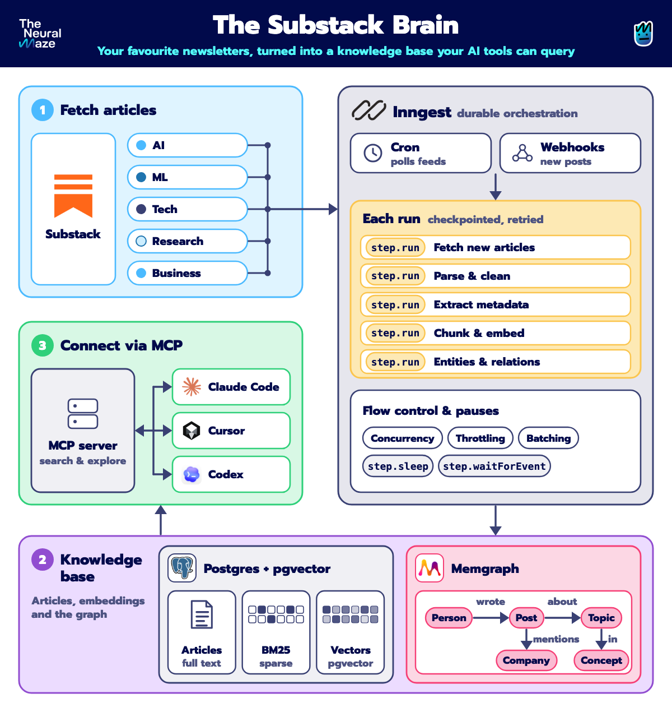
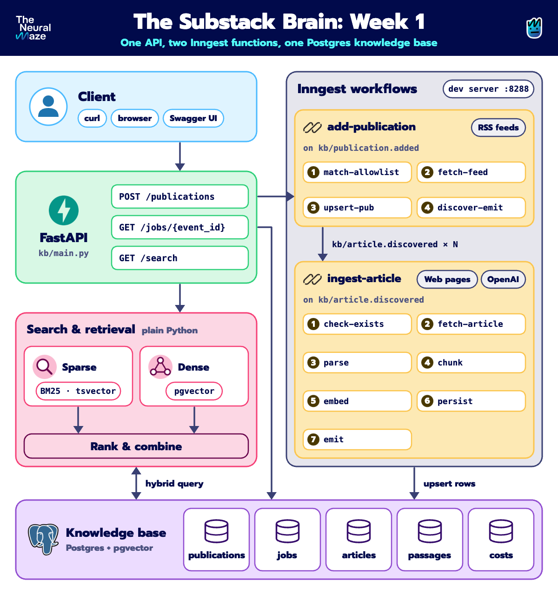

<div align="center">
  <h1>The Substack Brain</h1>
  <h3>Build a second brain from your favourite newsletters, one your AI tools can search, cite and reason over</h3>
</div>

</br>

<p align="center">
    <a href="static/course_overview.png"></a>
</p>


## Table of Contents

- [Table of Contents](#table-of-contents)
- [Course Overview](#course-overview)
- [Who is this course for?](#who-is-this-course-for)
- [Course Breakdown: Week by Week](#course-breakdown-week-by-week)
- [Getting Started](#getting-started)
- [Week 1: Your first durable pipeline](#week-1-your-first-durable-pipeline)
- [Our Sponsor](#our-sponsor)
- [Contributors](#contributors)


## Course Overview

This isn't your typical "call an LLM and print the result" tutorial. Most tutorials stop at the happy path. This course is about everything around it, the layer that decides whether a system survives a real Tuesday: **durable execution, retries that don't double-bill an API, idempotency, and evaluation built from real failures**.

So instead of a demo, we're building a real product: **The Substack Brain**, a knowledge base that turns technical newsletters into something your AI tools can query. It reads the articles, keeps itself fresh, understands who said what, and answers with citations. All of it runs on [Inngest](https://inngest.link/neural-maze-gh), the durable orchestration engine that makes it survive real-world failures.

By the end of this course, you'll have a system capable of:

* 📬 Ingesting newsletters straight from their RSS feeds, safely, from an allowlist
* ⚙️ Running every pipeline as **durable [Inngest](https://inngest.link/neural-maze-gh) steps** that survive crashes, retries and rate limits
* 🔎 Searching with **hybrid retrieval**: BM25 and dense vectors fused into one ranking, inside Postgres
* 💬 Answering questions with **citations** you can click and verify
* ⏱️ Staying fresh with a poller that costs almost nothing when nothing has changed
* 🕸️ Extracting who said what into a **Memgraph** knowledge graph
* 🔌 Plugging into **Claude Code, Cursor and Codex** through an MCP server
* 📊 Measuring quality with **evals built from your own failures**, not vibes
* 🤖 Running a bounded research agent and a weekly digest, deployed for real

We start absurdly simple (one newsletter, five articles, one Postgres table) and add one hard problem every week. **Week 1 is available now.**

Excited? Let's get started!

---

<table style="border-collapse: collapse; border: none;">
  <tr style="border: none;">
    <td width="20%" style="border: none;">
      <a href="https://theneuralmaze.substack.com/" aria-label="The Neural Maze">
        
      </a>
    </td>
    <td width="80%" style="border: none;">
      <div>
        <h2>📬 Stay Updated</h2>
        <p><b><a href="https://theneuralmaze.substack.com/">Join The Neural Maze</a></b> and learn to build AI Systems that actually work, from principles to production. Every Wednesday, directly to your inbox. Don't miss out!</p>
      </div>
    </td>
  </tr>
</table>

<p align="center">
  <a href="https://theneuralmaze.substack.com/">
    
  </a>
</p>

---

## Who is this course for?

This course is for Software Engineers, ML Engineers, and AI Engineers who can already write the happy path (call an LLM, chunk some text, stand up a FastAPI endpoint) and want to understand what separates that from a system you can actually leave running.


## Course Breakdown: Week by Week

Each week, you'll unlock **a new chapter of the journey**. We start absurdly simple (one newsletter, five articles, one Postgres table) and add exactly one hard problem per week. You'll get:

* 🧾 A Substack article that walks through the concepts and code in detail
* 💻 A new batch of code pushed directly to this repo
* 🎥 A video that explores the topic

Here's what the weeks look like 👇

| Week | 🛠️ You'll build | 🧾 Article | 💻 Code | 🎥 Video |
|:----:|:----------------|:----------:|:-------:|:--------:|
| <div align="center">1</div> | ⚙️ A durable RSS importer, triggered over plain HTTP, plus a first look at sparse and dense retrieval | Coming soon | [Week 1](docs/week-1.md) | Coming soon |
| <div align="center">2</div> | 📚 Backfilling 100-300 articles, hybrid retrieval, a first LLM answer with citations | Coming soon | Coming soon | Coming soon |
| <div align="center">3</div> | 🔄 A freshness poller and an MCP server | Coming soon | Coming soon | Coming soon |
| <div align="center">4</div> | 🕸️ Claim extraction into a Memgraph graph | Coming soon | Coming soon | Coming soon |
| <div align="center">5</div> | 📊 An evaluation suite built from your system's failures | Coming soon | Coming soon | Coming soon |
| <div align="center">6</div> | 🤖 A bounded research agent, a weekly digest and a production deploy | Coming soon | Coming soon | Coming soon |

---

## Getting Started

Before diving in, make sure you have:

1. 🐳 [Docker](https://docs.docker.com/get-docker/) running
2. 📦 [uv](https://docs.astral.sh/uv/) installed
3. 🔑 An [OpenAI API key](https://platform.openai.com/api-keys) with a little credit (used for embeddings; the whole of week 1 costs a few cents)

Then set up the project:

```bash
git clone https://github.com/neural-maze/substack-brain-course.git
cd substack-brain-course
cp .env.example .env        # fill in OPENAI_API_KEY (ANTHROPIC_API_KEY can stay empty)
```

Each week builds on the previous one, so follow them in order!

---

## Week 1: Your first durable pipeline

<p align="center">
    <a href="static/week_1_architecture_detailed.png"></a>
</p>

**Goal**: Build a pipeline that survives being killed mid-task, and search what it ingested.

### Steps:

1. 📖 **Read the guide**: Start with [`docs/week-1.md`](docs/week-1.md). It explains what Inngest is, what each container does, and why the pipeline is split into seven steps.
2. 🚀 **Start the system**:

   ```bash
   make start
   ```

   This starts Postgres, Adminer and the Inngest dev server with Docker Compose, runs the migrations, and launches the FastAPI app. It stays in the foreground, so use a second terminal for the rest.

3. 📥 **Ingest a newsletter** with plain HTTP:

   ```bash
   curl -X POST localhost:8000/publications \
     -H "Content-Type: application/json" \
     -d '{"feed_url": "https://theneuralmaze.com/feed"}'
   # → {"event_id": "...", "trace_url": "http://localhost:8288/event/...", "status": "queued"}

   curl localhost:8000/jobs/<event_id>
   # → {"status": "completed", "articles_done": 5, "articles_total": 5, ...}
   ```

4. 🔎 **Search it**:

   ```bash
   curl "localhost:8000/search?q=agents&mode=sparse"   # BM25 (Postgres full-text)
   curl "localhost:8000/search?q=agents&mode=dense"    # pgvector cosine similarity
   ```

   Try the same query in both modes and compare the results. They won't agree.

5. 💥 **Kill it and watch it resume**: Press Ctrl+C while the `embed` step is running, run `make start` again, and open the run in the Inngest UI. Only `embed` runs again. The guide walks you through it.

6. 🧪 **Run the tests**:

   ```bash
   make test
   ```

   The tests live in [`tests/test_basics.py`](tests/test_basics.py). They need no Docker, database or API key and run in about a second. They cover the small functions the pipeline is built from: URL cleanup, the allowlist, chunking and RSS parsing.

### Tools for looking inside

| Tool | URL | For |
|---|---|---|
| **Adminer** | `localhost:8081` | Browse Postgres and watch rows land in `articles` and `passages`. |
| **Inngest dev server** | `localhost:8288` | Every function, run and step, with its timeline and retries. |
| **Swagger UI** | `localhost:8000/docs` | Try every endpoint from the browser. |

### Useful commands

```bash
make check     # lint (ruff + mypy) and tests
make stop      # docker compose down (your data is kept)
make db-clear  # destructive: empties every table, keeps the schema
make reset     # destructive: docker compose down -v, drops all data
make nuke      # destructive: reset, plus kills a stray app process on the port
```

### Repository layout

- `kb/`: the pipeline (`functions/` for Inngest, `sources/` for fetch/parse/chunk/embed, `db/`, `retrieval/`, `schemas/`)
- `publications.yaml`: the allowlist of feeds the pipeline may ingest
- `alembic/`: database migrations
- `infra/docker-compose.yml`: Postgres (pgvector), Adminer, Inngest dev server
- `docs/week-1.md`: the step-by-step guide
- `tests/`: the simple tests

---

## Our Sponsor

<table>
  <tr>
    <td width="20%" align="center">
      <a href="https://inngest.link/neural-maze-gh" aria-label="Inngest">
        
      </a>
    </td>
    <td width="80%">
      <b><a href="https://inngest.link/neural-maze-gh">Inngest</a></b> is the durable execution engine behind this course. Every step's result is recorded, so a crashed run resumes instead of restarting. This course is made possible by their support. 💙
    </td>
  </tr>
</table>


## Contributors

<table>
  <tr>
    <td align="center"></td>
    <td>
      <strong>Miguel Otero Pedrido | Senior ML / AI Engineer </strong><br />
      <i>Founder of The Neural Maze. Rick and Morty fan.</i><br /><br />
      <a href="https://www.linkedin.com/in/migueloteropedrido/">LinkedIn</a><br />
      <a href="https://www.youtube.com/@TheNeuralMaze">YouTube</a><br />
      <a href="https://theneuralmaze.substack.com/">The Neural Maze Newsletter</a>
    </td>
  </tr>
  <tr>
    <td align="center"></td>
    <td>
      <strong>Antonio Zarauz Moreno | Cognitive-AI R&D / AI Engineer</strong><br />
      <i>Doesn't build AI wrappers — builds the infrastructure that makes them profitable, from PoC to thousands of concurrent users.</i><br /><br />
      <a href="https://www.linkedin.com/in/antonio-zarauz-moreno/">LinkedIn</a>
    </td>
  </tr>
</table>
